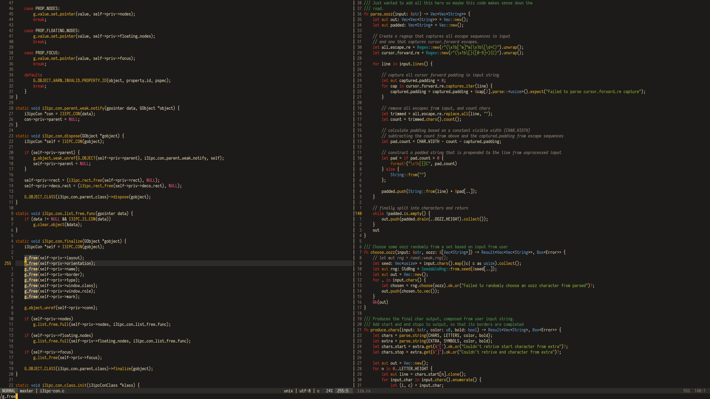

---
#
# By default, content added below the "---" mark will appear in the home page
# between the top bar and the list of recent posts.
# To change the home page layout, edit the _layouts/home.html file.
# See: https://jekyllrb.com/docs/themes/#overriding-theme-defaults
#
layout: master
title:
scripts: no
---

<main class="container mx-auto flex-grow w-5/6">
  

    

      

      

      

      

      

      

      

      

      

      

      

      

    

    

      <iframe src="https://ghbtns.com/github-btn.html?user=roosta&repo=vim-srcery&type=star&count=true" frameborder="0" scrolling="0" width="170px" height="20px"></iframe>
      <iframe src="https://ghbtns.com/github-btn.html?user=roosta&repo=vim-srcery&type=fork&count=true" frameborder="0" scrolling="0" width="170px" height="20px"></iframe>
    

    
The srcery color scheme with clearly defined contrasting colors and a slightly earthy tone.

    

      <h3 class="font-display mx-auto mb-6 border-b-2 border-white w-24">Preview</h3>
      
      
      
    

  

</main>
